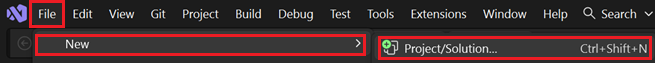
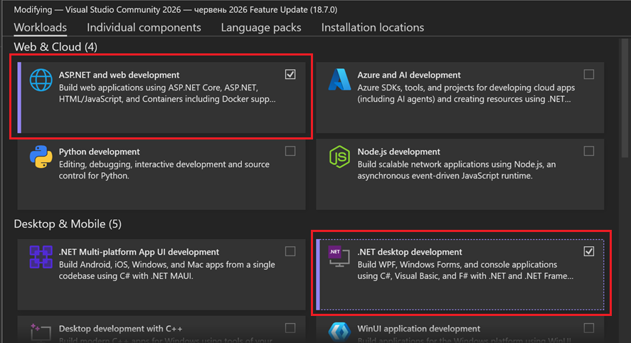
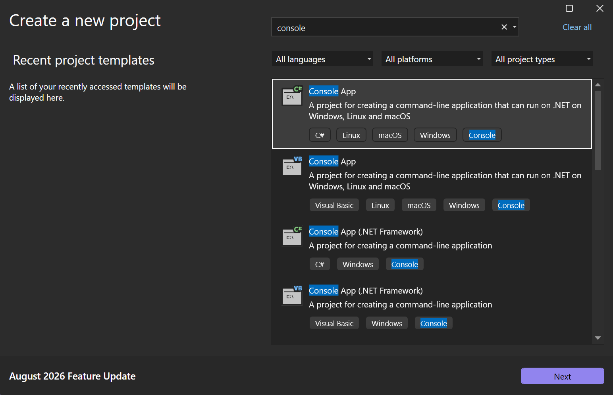
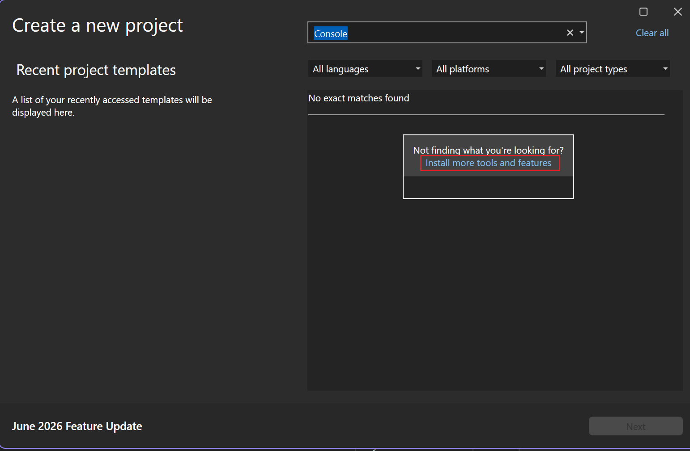

# Перший проєкт у Visual Studio

## Створення Console App за 5 кроків

1. **File → New → Project…** (або `Ctrl+Shift+N`).

2. У вікні «Create a new project» у пошуку введіть: `Console App`.
- виберіть <b>ASP.NET and web development</b> та <b>.NET desktop development</b> та встановіть.


3. Оберіть шаблон **Console App** (C#) — не «Console App (.NET Framework)»!


4. Натисніть **Next** і заповніть:
   - **Project name:** `MyFirstApp`
   - **Location:** `C:\Users\<ваше_імя>\source\repos`
   - ✅ **Place solution and project in the same directory** (опційно)
5. На наступному екрані:
   - **Framework:** `.NET 8.0 (Long Term Support)`
   - ☐ **Do not use top-level statements** — залиште зняте (нам потрібен сучасний синтаксис).
6. Натисніть **Create**.

## Структура проєкту

```
MyFirstApp/
├── MyFirstApp.csproj   ← конфігурація проєкту
└── Program.cs           ← точка входу, ваш код
```

Файл `Program.cs` спочатку містить лише один рядок:

```csharp
Console.WriteLine("Hello, World!");
```

## Як запускати

- **F5** — запуск з відлагодженням (Debug).
- **Ctrl+F5** — запуск без відлагодження (швидше).
- **F9** — поставити точку зупину (breakpoint) на поточному рядку.
- **F10** — крок через (step over) поточний рядок.
- **F11** — крок усередину (step into) методу.

## Як зберігати на USB-флешці

Папка проєкту самодостатня — її можна копіювати на флешку. На іншому комп'ютері (де є VS 2022) просто двічі клікніть `.sln` або `.csproj` — відкриється у VS.

## Як відкривати наш курс

1. У Solution Explorer натисніть **File → Open → Project/Solution…**
2. Знайдіть `C:\Users\…\Downloads\DotNet_Lessons\DotNetLessons.sln`.
3. Відкриється список усіх 30 проєктів курсу.
4. ПКМ на потрібному (наприклад, `Lesson01.Starter`) → **Set as Startup Project** → **F5**.

## Поради

- Якщо у Вас немає Console App, перейдіть Install more tools and features

- Якщо консольне вікно одразу закривається — додайте у кінці `Console.ReadKey();`.
- Для української мови у виводі: `Console.OutputEncoding = System.Text.Encoding.UTF8;`
- IntelliSense — головний друг: тиснути `Ctrl+Space` для підказок.
- Форматування коду: `Ctrl+K, Ctrl+D` — автоматично вирівняє відступи.
